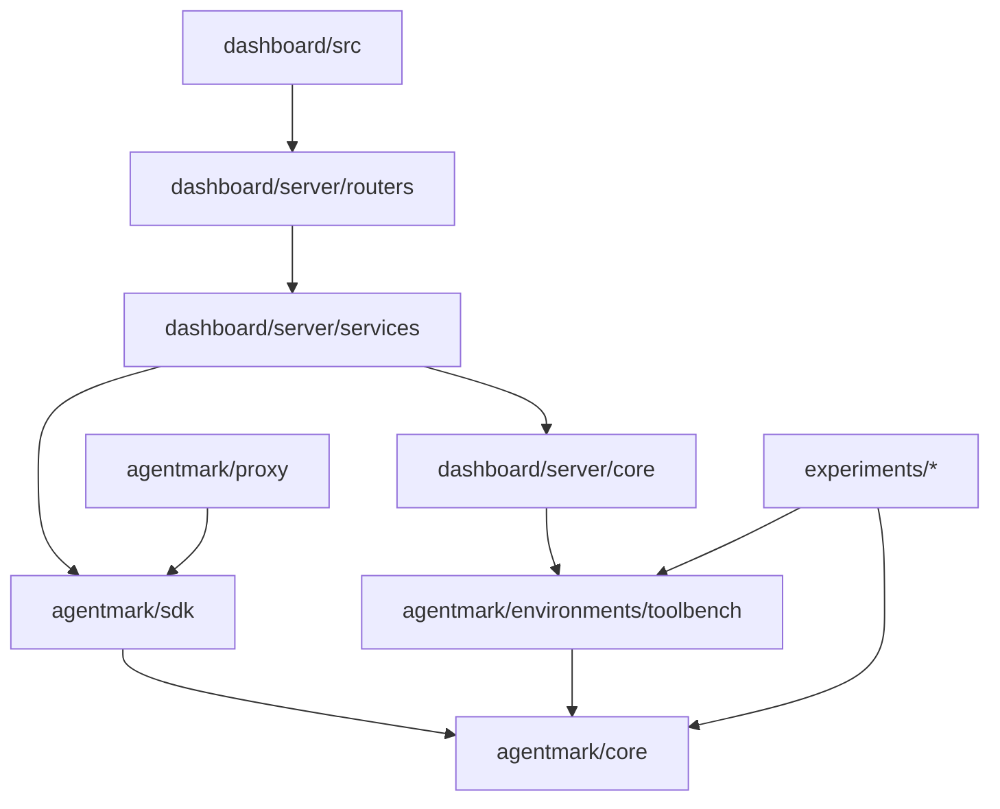

# Architecture

## 项目定位
AgentMark 是一个面向 LLM Agent 的行为水印框架，目标是在不显著破坏效用的前提下提供可验证的归属与溯源能力，并支持多环境实验和可视化分析。

## 模块地图

## 分层规则
- 核心层：`agentmark/core/` 负责采样、编码、日志解析等基础能力。
- 适配层：`agentmark/environments/` 负责不同环境封装，可依赖核心层。
- SDK 层：`agentmark/sdk/` 负责可集成接口，可依赖核心层。
- 代理层：`agentmark/proxy/` 负责网关拦截与注入，可依赖 SDK 与核心层。
- 服务层：`dashboard/server/` 负责会话编排和 API，不得反向污染核心层边界。
- 展示层：`dashboard/src/` 仅通过 HTTP 与服务层交互，不直连 Python 模块。
- 实验层：`experiments/*` 复用核心能力运行评测，禁止反向被核心层依赖。

明确禁止：
- 禁止 `agentmark/core/` 导入 `experiments/*` 或 `dashboard/*`。
- 禁止 `dashboard/src/` 导入 `dashboard/server/*` 或任何 `agentmark/*` Python 包。
- 禁止 `dashboard/server/routers/` 直接调用实验脚本路径。
- 禁止将隔离子树作为主仓架构规则依据：`experiments/oasis_watermark/oasis/`、`experiments/toolbench/MarkLLM/`、`dashboard/.git_backup/`。

## 关键路径
1. 用户在前端发起实验请求，入口位于 `dashboard/src/`。
2. 请求进入 `dashboard/server/routers/api.py`，路由层完成参数验证。
3. 服务层结合 `dashboard/server/core/session.py` 维护会话状态。
4. 推理与水印能力通过 `agentmark/sdk/` 与 `agentmark/core/watermark_sampler.py` 执行。
5. ToolBench 等环境通过 `agentmark/environments/toolbench/` 适配工具与动作空间。
6. 结果回传前端并由可视化组件展示日志、轨迹和指标。

## 横切关注点
- 认证与密钥：通过环境变量注入 API Key，配置解析见 `dashboard/server/utils/config.py`。
- 日志与可观测：运行日志、轨迹日志和水印日志需统一结构，详见 `docs/operations/observability.md`。
- 质量与门禁：架构守卫和文档健康检查位于 `scripts/guards/`，在 CI 中强制执行。
- 文档治理：所有新增文档必须写入对应 `index.md`，避免知识孤岛。
- 数据与缓存：ToolBench 检索缓存由 `entrypoint.sh` 初始化，路径依赖需在运行手册显式记录。

## 目录边界说明
- 主治理区：仓库根、`agentmark/`、`dashboard/`（排除备份子树）、`experiments/`（排除隔离子树）。
- 隔离治理区：`experiments/oasis_watermark/oasis/`、`experiments/toolbench/MarkLLM/`、`dashboard/.git_backup/`。
- 隔离区默认只做索引说明，不阻塞主仓规则守卫。
