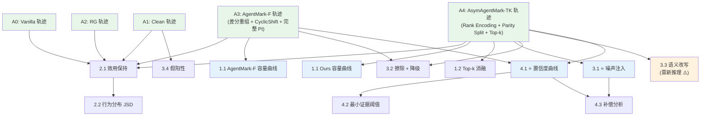

# AsymAgentMark-TK 实验设计细节

# 🔧 实验基础设置

## 基座模型

✅ **已确认**：

- **主实验模型**：DeepSeek、Gemini Flash 2.0
- **跨模型推断**：嵌入用模型 A（如 DeepSeek），解码用模型 B（如 Gemini Flash 2.0），反之亦然

<aside>
✅

**Q1 已确认**：主实验使用 DeepSeek + Gemini Flash 2.0。跨模型推断在这两个模型之间交叉进行。

</aside>

## 数据集与环境

沿用 AgentMark 原始实验环境：

| **任务类型** | **数据集** | **子集/变体** | **行为空间 n** | **备注** |
| --- | --- | --- | --- | --- |
| 具身规划 | ALFWorld | ID / OOD | 待确认（原文约 10–30 候选动作） | AgentMark 原文 bps ≈ 1.2 |
| 工具调用 | ToolBench | 6 个子集 | 待确认 | AgentMark 原文 bps ≈ 0.49 |
| 社交仿真 | OASIS | Twitter-like / Reddit-like | 待确认 | AgentMark 原文有对应实验 |

<aside>
✅

**Q2 已确认**：优先跑 ALFWorld（ID 134 + OOD 140）+ ToolBench（6 类 × 20 = 120），全量跑。OASIS 待定，视时间安排作为补充。

</aside>

## Baseline 配置

| **Baseline** | **角色** | **实现细节** |
| --- | --- | --- |
| Vanilla（纯 LLM） | pipeline 透明性验证 | 完全不经过 AgentMark pipeline，LLM 直接以 ReAct 等原始框架生成动作，无候选动作排名采样 |
| Clean（无水印） | 效用 upper bound | 经过 AgentMark pipeline（候选动作生成 → $P_t$ 计算 → 概率加权采样），但不做水印嵌入 |
| Red-Green（RG） | 行为水印 lower bound | 偏置采样，0-bit 检测。沿用 AgentMark 原文的 RG 实现 |
| AgentMark-F（精确解码） | 直接改进对象 | 差分重组 + CyclicShift + RLNC，解码使用完整精确 $P_t$ |
| **AsymAgentMark-TK（Ours）** | 本文方法 | 与 AgentMark-F 共享候选动作生成、RLNC payload 编码等外围流程；核心水印编码端改为基于 Top-k ranking 的 rank-aware / parity-split 编码，解码侧仅依赖排名知识 |

## LLM 推理参数

沿用 AgentMark 原文配置（Appendix G.1）：

| **参数** | **ALFWorld** | **ToolBench** | **备注** |
| --- | --- | --- | --- |
| Temperature | **1.0** | **0.7** | 原文明确写了两个数据集温度不同 |
| Max steps/episode | **30 步** | **10 步** | ALFWorld cap 30 步，ToolBench cap 10 步 |
| 原文基座模型 | DeepSeek-Chat | DeepSeek-Chat | 我们改为 DeepSeek + Gemini Flash 2.0 |
|  |  |  |  |

<aside>
⚠️

**温度 > 0 意味着每轮采样有随机性**，因此 3 轮独立运行会产生不同结果，报告 mean ± std 是有意义的。

**我们的实验**应沿用相同温度设置（ALFWorld T=1.0，ToolBench T=0.7），确保与原文可比。

</aside>

## 水印参数

- **Payload 长度** $L = 8$（已确认）
- **RLNC 冗余率**：沿用 AgentMark 原文配置
- **密钥 / 种子 / 轮次**：沿用 AgentMark 原文协议——
    - 固定水印密钥（key）
    - 固定 payload（如 `0x42`）
    - 每个任务跑 **3 轮**（应对 LLM 采样随机性），报告 mean ± std
    - 统计方差来源：不同任务实例 × 3 轮 LLM 采样
    - 可选附加（待定）：跑完主实验后换 2~3 个 payload 各跑 1 轮，验证 payload 无关性（附录级别）

<aside>
✅

**Q3 已确认**：Payload 长度 $L = 8$。协议：固定 key + 固定 payload，每任务 3 轮，与 AgentMark 原文一致。

</aside>

## 信道知识等级定义

实验的核心自变量，从高到低排列：

| **等级** | **标签** | **描述** | **实现方式** |
| --- | --- | --- | --- |
| L0 | 精确 $P_t$（Oracle） | 验证方拥有与嵌入侧完全相同的概率分布 | 直接复用嵌入时的 $P_t$ |
| L1 | Top-k 同模型（k=10） | 验证方用同一模型重新推断，仅取 Top-10 排名 | 重跑推理，取 argmax 前 10 |
| L2 | Top-k 同模型（k=5） | 同上，仅取 Top-5 | 重跑推理，取 argmax 前 5 |
| L3 | Top-k 同模型（k=3） | 同上，仅取 Top-3 | 重跑推理，取 argmax 前 3 |
| L4 | Top-k 同模型（k=2） | 同上，仅取 Top-2 | 重跑推理，取 argmax 前 2 |
| L5 | Top-k 跨模型推断 | 验证方使用**不同模型**推断 Top-k 排名 | 嵌入用模型 A，解码用模型 B 的 Top-k |
| L6 | 含噪排名 | Top-k 排名中注入随机相邻交换噪声 | 以概率 $\epsilon$ 交换相邻位置，Kendall tau 距离约束下的随机排列 |

---

# 轴 1：容量实验（Capacity）

## 实验 1.1 ⭐ 有效容量对比（核心图）

**目标**：展示不同信道知识等级下，各方法的 $C_{\text{eff}}$ 变化曲线。这是论文的**核心实验图**。

### 实验设计

- **自变量**：信道知识等级（L0 → L6），见上方定义
- **因变量**：$C_{\text{eff}} = C_{\text{nom}} \times \text{Decode Success Rate}$
- **方法**：Clean / RG / AgentMark-F / AsymAgentMark-TK
- **数据集**：ALFWorld（主图）+ ToolBench（附图）

### 具体步骤

1. 对每个方法 × 数据集，全量生成水印 trajectory × 3 轮（ALFWorld: 274 × 3 = 822 条；ToolBench: 120 × 3 = 360 条）
2. 对每条 trajectory，在各信道知识等级下尝试解码
3. 计算各等级下的 Decode Success Rate = 成功解码条数 / N
4. $C_{\text{eff}} = C_{\text{nom}} \times \text{Decode Success Rate}$

### 预期结果

- **AgentMark-F**：在 L0（精确 $P_t$）时 $C_{\text{eff}}$ 最高（≈ $\log_2 n$），但从 L1 开始急剧下降，L3–L6 趋近于 0
- **AsymAgentMark-TK**：在 L0 时名义容量略低于 AgentMark-F，但从 L1 开始 $C_{\text{eff}}$ 保持稳定，在 L2–L5 区间远超 AgentMark-F
- **RG**：始终为 0-bit（无多比特解码能力）

### 可视化

- **主图**：折线图，X 轴 = 信道知识等级（L0→L6），Y 轴 = $C_{\text{eff}}$（bps），不同方法用不同颜色/线型
- **附图**：同结构，ToolBench 数据集

### 实现细节待确认

<aside>
✅

**Q4 已确认**：AgentMark-F 在 L1–L4 下的"最佳努力"策略 = 用 Top-k 排名反推近似 $P_t$，再做 CyclicShift 解码。这保证了对比的公平性——AgentMark-F 也能利用部分信道知识做最优尝试。

</aside>

<aside>
✅

**Q5 已确认**：解码成功 = payload **完全匹配**（bit-exact match）。可选附加指标：bit-level accuracy 作为辅助分析。

</aside>

---

## 实验 1.2 Top-k 消融

**目标**：细粒度分析 Top-k 中 $k$ 值与解码能力的关系。

### 实验设计

- **自变量**：$k = 2, 3, 5, 10, \text{full}$
- **因变量**：
    - 名义容量 $C_{\text{nom}}$（bps）
    - Decode Success Rate
    - $C_{\text{eff}}$
- **方法**：仅 AsymAgentMark-TK（这是我们方法的内部消融）
- **数据集**：ALFWorld + ToolBench

### 具体步骤

1. 固定嵌入（同一批 trajectory）
2. 对每个 $k$ 值，提取 Top-k 排名并执行 Parity Split 解码
3. 记录名义容量（理论值，由 $k$ 和行为分布决定）和实际 Decode Success Rate

### 预期结果

- $k$ 越大 → $C_{\text{nom}}$ 越高（更多排名信息）
- $k$ 从 2 增到 5 时 $C_{\text{eff}}$ 提升最显著（边际收益递减）
- $k = \text{full}$ 时 $C_{\text{nom}}$ 接近但仍低于 AgentMark-F 的 $\log_2 n$（因为排名丢失了概率值的精确信息）

### 可视化

- **主图**：柱状图 or 折线图，X 轴 = $k$ 值，Y 轴 = $C_{\text{eff}}$，附带 $C_{\text{nom}}$ 虚线
- **附表**：详细数值（$k$, $C_{\text{nom}}$, Decode Success Rate, $C_{\text{eff}}$）

### 待确认

<aside>
✅

**Q6 已确认**：$C_{\text{nom}}$ 的理论公式区间 $[1 - p_{\max},\ H(D)]$ 应为严格推导结果。实验中使用理论值，无需蒙特卡洛估计。

</aside>

---

# 轴 2：感知实验（Perception / Undetectability）

## 实验 2.1 效用保持

**目标**：验证 rank-aware 编码不会显著损害任务效用。由于 AsymAgentMark-TK 与 AgentMark-F 的核心水印编码端不同，不能假设二者效用天然一致，需要分别与 Clean / Vanilla 比较。

### 实验设计

- **自变量**：方法（Vanilla / Clean / RG / AgentMark-F / AsymAgentMark-TK）× 基座模型
- **因变量**：
    - **Success Rate（SR）**：任务完成率
    - **平均步骤数**：完成任务所需的行为步数
- **数据集**：ALFWorld（ID + OOD）、ToolBench（6 子集）、OASIS

### 具体步骤

1. 对每个方法 × 模型 × 数据集组合，运行完整任务评估
2. 统计 SR 和平均步骤数
3. 分别比较 AgentMark-F 与 AsymAgentMark-TK 相对 Clean / Vanilla 的 SR 与平均步骤数变化，并报告二者差异是否在统计误差范围内

### 预期结果

- Vanilla ≈ Clean 作为效用参考上界
- AgentMark-F 与 AsymAgentMark-TK 都应尽量接近 Clean，但二者差异需要实测，不预设完全一致
- 若 AsymAgentMark-TK 略低于 AgentMark-F，需要报告 rank-aware 编码带来的 utility-capacity tradeoff

### 可视化

- **表格**：方法 × 数据集，报告 SR（%）± std 和平均步骤数

---

## 实验 2.2 行为分布统计检验

**目标**：验证水印行为序列与 Clean 序列的统计不可区分性。

### 实验设计

- **自变量**：方法（Vanilla / Clean / RG / AgentMark-F / AsymAgentMark-TK）
- **因变量**：JSD 散度（Jensen-Shannon Divergence）
- **检验对象**：行为频率分布

### 具体步骤

1. 对每个方法，**复用实验 2.1 的 trajectory**（无需重新生成）收集行为序列
2. 统计每种行为的出现频率，得到经验分布 $\hat{P}_{\text{method}}$
3. 计算 $\text{JSD}(\hat{P}_{\text{Clean}} \| \hat{P}_{\text{method}})$
4. 可选：做 χ² 检验或 KS 检验，报告 p-value

### 预期结果

- $\text{JSD}(\text{Clean}, \text{AgentMark-F}) \approx \text{JSD}(\text{Clean}, \text{Ours}) \approx 0$
- $\text{JSD}(\text{Clean}, \text{RG}) \gg 0$

### 可视化

- **柱状图**：每个方法的 JSD 值
- **附图（可选）**：行为频率分布直方图叠加对比

---

# 轴 3：鲁棒实验（Robustness）

## 实验 3.1 ⭐ 排名噪声注入

**目标**：验证排名不精确时的解码鲁棒性——弱非对称方案的核心卖点。

### 实验设计

- **自变量**：噪声率 $\epsilon \in \{0, 0.05, 0.1, 0.15, 0.2, 0.3, 0.5\}$
- **噪声模型**：对 Top-k 排名中的每对相邻位置，以概率 $\epsilon$ 交换
- **因变量**：Decode Success Rate、$C_{\text{eff}}$
- **方法**：AsymAgentMark-TK（不同 $k$ 值）

### 具体步骤

1. 使用已有的水印 trajectory
2. 在解码阶段，对 Top-k 排名注入噪声（多次重复取平均）
3. 统计各噪声率下的 Decode Success Rate

### 预期结果

- $\epsilon$ 从 0 增加到 0.1 时 Decode Success Rate 缓慢下降
- $\epsilon > 0.3$ 时开始显著下降
- $k$ 越大，对噪声越鲁棒（更多冗余排名信息）

### 可视化

- **折线图**：X 轴 = $\epsilon$，Y 轴 = Decode Success Rate，不同 $k$ 值用不同线

<aside>
✅

**Q7 已确认**：噪声模型使用两种——① 相邻交换（以概率 $\epsilon$ 交换相邻位置）；② Kendall tau 距离约束下的随机排列（控制排列与原排名的 Kendall tau 距离）。两种模型分别画线对比。

</aside>

---

## 实验 3.2 步骤擦除 + 信道降级联合

**目标**：验证 RLNC 与弱非对称解码的叠加鲁棒性。

### 实验设计

- **自变量**：
    - 擦除率 $r \in \{0, 0.1, 0.2, 0.3, 0.5, 0.7, 0.9\}$
    - $k$ 值 $\in \{3, 5, 10\}$
- **因变量**：payload 恢复成功率、$C_{\text{eff}}$
- **方法**：AgentMark-F + RLNC / AsymAgentMark-TK + RLNC

### 具体步骤

1. 生成水印 trajectory（含 RLNC 编码）
2. 随机擦除 $r$ 比例的步骤
3. 在指定信道知识等级下尝试解码
4. 统计 payload 恢复成功率

### 预期结果

- AgentMark-F + RLNC：擦除本身可通过 RLNC 恢复，但信道降级（非 L0）后解码仍失败
- AsymAgentMark-TK + RLNC：擦除 + 降级双重条件下仍可恢复 payload

### 可视化

- **热力图**：X 轴 = 擦除率，Y 轴 = $k$ 值，颜色 = payload 恢复成功率
- 对比两个方法的热力图

---

## 实验 3.3 语义改写

**目标**：验证 prompt 扰动下排名的稳定性以及解码的鲁棒性。

### 实验设计

- **自变量**：改写强度（轻度 / 中度 / 重度）
- **改写方式**：
    - **轻度**：prompt 中同义词替换（如 "pick up" → "grab"）
    - **中度**：prompt 句式重组 + 少量信息增删
    - **重度**：完全改写 prompt，仅保留任务语义
- **因变量**：
    - 排名保持率 = $\frac{1}{N}\sum_{t} \mathbb{1}[\text{rank}_{\text{orig}}(t) = \text{rank}_{\text{rewrite}}(t)]$
    - Decode Success Rate

### 具体步骤

1. 对每条 trajectory 的每一步，记录原始 prompt 下的 Top-k 排名
2. 用 LLM 自动改写 prompt（按不同强度）
3. 重新推断 Top-k 排名
4. 比较排名变化，尝试解码

### 预期结果

- 轻度改写下排名保持率 > 90%，解码几乎不受影响
- 中度改写下排名保持率 70–85%，Decode Success Rate 有所下降但仍可用
- 重度改写下排名大幅变化，但 AsymAgentMark-TK 通过 RLNC 仍有部分恢复能力

<aside>
✅

**Q8 已确认**：改写工具用 **DeepSeek**。改写强度定义：

- **操作定义**（输入侧）：通过改写 prompt 控制——轻度 = 仅同义词替换；中度 = 句式重组 + 增删细节；重度 = 完全改写仅保留任务目标
- **事后度量**（输出侧）：计算 ROUGE-L 和 token-level Jaccard similarity，论文中每个强度级别附上均值作为客观量化
</aside>

---

## 实验 3.4 🛡️ 假阳性检验

**目标**：验证信道知识降级不会引入额外的误判风险。

### 实验设计

- **自变量**：$k$ 值 × payload 长度 $L$
- **因变量**：FPR（False Positive Rate）
- **检验方式**：对**未嵌入水印**的 Clean trajectory，使用随机 payload 尝试解码，统计"意外匹配"的比例

### 具体步骤

1. 生成大量 Clean trajectory（无水印）
2. 对每条 trajectory，使用 1000 个随机 payload 尝试解码
3. 统计匹配成功的比例 = FPR
4. 对不同 $k$ 值和 $L$ 值重复

### 预期结果

- FPR 随 $L$ 指数下降：$\text{FPR} \approx 2^{-L}$
- $k$ 值对 FPR 影响很小（排名知识等级不影响假阳性）

### 可视化

- **表格**：$k$ × $L$ 的 FPR 值
- **折线图**：X 轴 = $L$，Y 轴 = $\log_2(\text{FPR})$，不同 $k$ 线几乎重合

---

# 轴 4：证据强度实验（Evidence Significance）

## 实验 4.1 ⭐ 解码置信度曲线

**目标**：展示行为序列长度 $N$ 与解码统计显著性的关系。

### 实验设计

- **自变量**：观测步数 $N \in \{5, 10, 20, 30, 50, 80, 100, 150, 200\}$
- **方法**：AgentMark-F（L0） / AsymAgentMark-TK（不同 $k$）
- **因变量**：p-value（检验 H0: "该序列未嵌入水印"）

### 检验方法

- **H0（零假设）**：行为序列由无水印 Agent 生成
- **H1（备择假设）**：行为序列嵌入了特定 payload
- **检验统计量**：
    - 方案 A：t 检验——比较解码得分（如 Parity Split 的一致性比例）与随机基线
    - 方案 B：似然比检验——$\Lambda = \frac{P(\text{sequence} | \text{H1, payload=m})}{P(\text{sequence} | \text{H0})}$

<aside>
✅

**Q9 已确认**：使用**单侧二项检验（one-sided binomial test）**。

- **解码得分**：每步 $t$ 从 Top-k 排名提取 parity bit，与 payload 预期 bit 比较，一致则 $\text{match}_t = 1$
- **统计量** $S = \sum_{t=1}^{N} \text{match}_t$
- **H0**（无水印）：$S \sim \text{Binomial}(N, 0.5)$
- **p-value** = $P(S \geq s_{\text{obs}} \mid H_0)$
- 优势：离散 0/1 数据天然适配二项检验，小样本也精确，无需正态近似
</aside>

### 预期结果

- p-value 随 $N$ 增大而超指数衰减
- $k$ 越大，相同 $N$ 下 p-value 越小（每步信息量更多）
- 类似 InfoTracer Fig.5 的曲线形态

### 可视化

- **对数折线图**：X 轴 = $N$，Y 轴 = $\log_{10}(\text{p-value})$，不同 $k$ 值分别画线
- 画水平虚线标注 $\alpha = 0.05, 0.01, 0.001$ 的显著性阈值

---

## 实验 4.2 最小证据阈值

**目标**：确定达到目标显著性水平所需的最少观测步数 $N_{\min}$。

### 实验设计

- **自变量**：$k$ 值 × payload 长度 $L$ × 显著性水平 $\alpha \in \{0.05, 0.01, 0.001\}$
- **因变量**：$N_{\min}$（达到 $p < \alpha$ 所需最少步数）

### 具体步骤

1. 从实验 4.1 的数据中，对每个配置找到 p-value 首次低于 $\alpha$ 的 $N$ 值
2. 可通过插值获得更精确的 $N_{\min}$

### 预期结果

- $k$ 越大 → $N_{\min}$ 越小
- $L$ 越长 → $N_{\min}$ 越大（更多比特需要更多观测）
- 理论目标：$N_{\min} \propto \frac{L}{\log_2 k}$（如果能推导出来）

### 可视化

- **热力图**：X 轴 = $k$，Y 轴 = $L$，颜色 = $N_{\min}$（分别画 $\alpha = 0.05, 0.01, 0.001$）

---

## 实验 4.3 鲁棒性补偿分析

**目标**：量化攻击条件下维持相同显著性所需的额外步数。

### 实验设计

- **自变量**：排名噪声率 $\epsilon$ × 擦除率 $r$
- **因变量**：补偿倍率 $N_{\text{attack}} / N_{\text{clean}}$

### 具体步骤

1. 对每个 ($\epsilon$, $r$) 组合，测量达到 $p < 0.01$ 所需的 $N_{\text{attack}}$
2. 与无攻击条件下的 $N_{\text{clean}}$ 比较
3. 计算补偿倍率

### 理论目标（高价值）

推导线性补偿性质：

$N_{\text{attack}} \approx \frac{1}{(1 - \epsilon)^2} \cdot N_{\text{clean}}$

如果实验数据支持此公式 → Lemma 级理论贡献

### 可视化

- **折线图**：X 轴 = $\epsilon$（或 $r$），Y 轴 = 补偿倍率，附理论预测线

---

# 🗂️ 实验执行计划

## 🔗 数据依赖与执行时序

核心原则：**嵌入侧生成轨迹是最昂贵的环节**（需要 GPU/API 调用）；大部分实验只是对同一批轨迹做不同方式的**解码端后处理**，无需重新生成。

### 阶段 A：轨迹生成（最耗资源）

所有后续实验的数据基础。只需跑一次，保存完整中间产物。

注：ALFworldOD和ID的任务全采样（134+140），toolbench使用固定随机种子6个任务类别每个采样20个任务。

<aside>
💡

大规模跑前先少任务量测试（比如10个），确认没问题了再大规模跑

</aside>

| **批次** | **方法** | **规模** | **需保存的中间产物** |
| --- | --- | --- | --- |
| A0 | Vanilla（纯 LLM） | 2 模型 × (ALF 274 + TB 120) × 3 轮 = **2,364 条** | 行为序列、SR、步骤数、完整 prompt 以及模型回复、token 消耗、时间 |
| A1 | Clean（无水印） | 2 模型 × (ALF 274 + TB 120) × 3 轮 = **2,364 条** | 行为序列、SR、步骤数、完整prompt以及模型回复、token消耗、时间 |
| A2 | Red-Green (RG) | 同上 = **2,364 条** | 行为序列、SR、步骤数、完整prompt以及模型回复、token消耗、时间 |
| A3 | AgentMark-F | 同上 = **2,364 条** | 行为序列、SR、步骤数、**完整** $P_t$、差分重组结果、CyclicShift offset / symbol 映射、RLNC 编码符号、被选动作及其概率 / rank、完整prompt以及模型回复、token消耗、时间 |
| A4 |  AsymAgentMark-TK | 同上 = **2,364 条** | 行为序列、SR、步骤数、候选动作集合、**每步 Top-k 排名**（k=10）、rank partition / parity split 映射、每步 rank-derived symbol / parity bit、RLNC 编码符号、最终被选动作及其 rank、完整prompt以及模型回复、token消耗、时间；可选保存完整 $P_t$ 供 oracle 分析 |

**A0–A4 可并行执行**（互不依赖），是整个实验的瓶颈。A3 与 A4 使用相同任务集合、模型配置、key / payload / seed 设置，但由于编码端不同，需要分别生成 trajectory；后续做 paired comparison。

---

### 阶段 B：核心指标（纯后处理，复用阶段 A 轨迹）

阶段 A 完成后，以下实验**全部可并行**，无需新推理。

| **实验** | **名称** | **数据来源** | **后处理内容** |
| --- | --- | --- | --- |
| **2.1** | 效用保持 | A0 + A1 + A2 + A3 + A4 | 直接从保存的 SR、步骤数统计，分别比较 AgentMark-F 与 Ours 相对 Clean / Vanilla 的效用变化，**零额外计算** |
| **2.2** | 行为分布统计检验 | ← 复用 2.1 | 对行为序列统计频率分布 → JSD，**零额外计算** |
| **1.1** | ⭐ 有效容量对比 | A3 + A4 | 对 A3 的 AgentMark-F 轨迹与 A4 的 Ours 轨迹分别在 L0–L6 各信道等级下解码，统计 Decode Success Rate → $C_{\text{eff}}$ |
| **1.2** | Top-k 消融 | A4 | 对同一批 Ours 轨迹，取不同 k 值的排名子集做 Parity Split 解码 |

<aside>
💡

**2.1 → 2.2** 严格来说有顺序（2.2 复用 2.1 的轨迹），但实际是同一批数据不同角度分析，可同时进行。

**1.1 和 1.2** 也可并行——1.1 是跨方法 × 跨信道等级，数据来自 A3 + A4；1.2 是 Ours 单方法 × 跨 k 值，数据来自 A4。

</aside>

---

### 阶段 C：鲁棒性实验（大部分后处理 + 一个需要新推理）

| **实验** | **名称** | **数据来源** | **是否需要新推理** | **后处理内容** |
| --- | --- | --- | --- | --- |
| **3.1** | ⭐ 排名噪声注入 | A4 | ❌ 否 | 对 Ours 已有 Top-k 排名注入噪声（模拟相邻交换 / Kendall tau），重新解码；如比较 AgentMark-F，则用 A3 做 best-effort Top-k 近似解码对照 |
| **3.2** | 步骤擦除 + 信道降级 | A3 + A4 | ❌ 否 | 分别对 AgentMark-F 与 Ours 轨迹随机擦除步骤 + 在降级信道下解码（RLNC 恢复） |
| **3.4** | 假阳性检验 | A1 | ❌ 否 | 对 Clean 轨迹用 1000 个随机 payload 尝试解码，统计 FPR |
| **3.3** | 语义改写 | A4 + **新推理** | ✅ 是 | ① DeepSeek 改写 prompt ② 用改写后 prompt 重新推断 Top-k 排名 ③ 对比 Ours 解码；如需横向比较，再对 A3 加做 AgentMark-F 对照 |

<aside>
⚠️

**3.3 是唯一需要大量新推理的鲁棒性实验**：每条轨迹 × 每步 × 3 种改写强度 → 改写 prompt + 重跑模型推断。成本约为阶段 A 的 3 倍。建议放在最后，确认主实验结果后再决定是否跑。

**3.1、3.2、3.4** 均为后处理，可与阶段 B 并行。

</aside>

---

### 阶段 D：证据强度（纯后处理，依赖阶段 B/C 结果）

| **实验** | **名称** | **数据来源** | **后处理内容** |
| --- | --- | --- | --- |
| **4.1** | ⭐ 解码置信度曲线 | A3 + A4 | 分别截取 AgentMark-F 与 Ours 轨迹的前 N 步做二项检验，计算 p-value 随 N 的变化 |
| **4.2** | 最小证据阈值 | ← 复用 4.1 | 从 4.1 数据中找 $N_{\min}$，纯二次分析 |
| **4.3** | 鲁棒性补偿分析 | 3.1 + 4.1 | 在噪声/擦除条件下重复 4.1 的 p-value 分析，计算补偿倍率 |

<aside>
💡

**4.1** 可与阶段 B 并行（依赖 A3 + A4）。

**4.2** 是 4.1 的衍生分析，4.1 完成后即可出。

**4.3** 需要 3.1 的噪声解码结果 + 4.1 的 p-value 框架，因此排在 3.1 和 4.1 之后。

</aside>

---

### 📅 推荐执行时序总览

<aside>
📌

**第 1 周：阶段 A — 轨迹生成**（瓶颈，A0/A1/A2/A3 并行）

↓ 所有轨迹 + 中间产物就绪（A3 与 A4 分别生成）

**第 2 周：阶段 B + C（后处理部分）+ D（4.1）— 全部并行**

- 2.1 效用保持 → 2.2 行为分布（秒级）
- 1.1 容量对比 + 1.2 Top-k 消融（分钟级）
- 3.1 噪声注入 + 3.2 擦除降级 + 3.4 假阳性（分钟级）
- 4.1 置信度曲线（分钟级）

↓ 核心结果出炉，可开始写论文

**第 3 周：收尾 + 可选实验**

- 4.2 最小证据阈值（基于 4.1，秒级）
- 4.3 补偿分析（基于 3.1 + 4.1，分钟级）
- 3.3 语义改写（**如果时间允许**，需要大量新推理）
</aside>

---

### 🔄 轨迹复用关系图

🟢 绿色 = 轨迹生成（阶段 A）｜ 🔵 蓝色 = 核心实验（⭐）｜ 🟠 橙色 = 需新推理（昂贵）

## 优先级排序

| **优先级** | **实验** | **名称** | **理由** |
| --- | --- | --- | --- |
| P0 | 1.1 | ⭐ 有效容量对比（核心图） | 论文最核心的图，决定 story 是否成立 |
| P0 | 2.1 | 效用保持 | 必须证明嵌入侧不变 → 效用不退化 |
| P1 | 1.2 | Top-k 消融 | 支撑 k 值选择的合理性 |
| P1 | 3.1 | ⭐ 排名噪声注入 | 弱非对称的核心卖点 |
| P1 | 3.4 | 假阳性检验 | 安全性基线，必须有 |
| P2 | 3.2 | 步骤擦除 + 信道降级联合 | RLNC 叠加验证 |
| P2 | 2.2 | 行为分布统计检验 | 进一步支撑感知性 |
| P2 | 4.1 | ⭐ 解码置信度曲线 | 证据强度核心图 |
| P3 | 3.3 | 语义改写 | 实现成本较高，视时间安排 |
| P3 | 4.2 | 最小证据阈值 | 基于 4.1 数据的二次分析 |
| P3 | 4.3 | 鲁棒性补偿分析 | 理论性强，有 Lemma 潜力 |

---